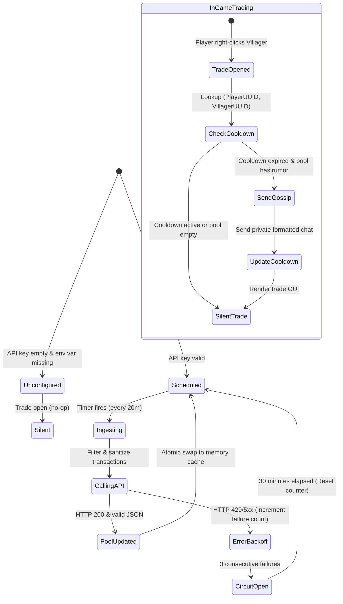

# Data Model: Gemini-Powered Villager Gossip

## 1. Entities & In-Memory Records

### 1.1. `GossipConfig`

Configuration record mapping to `config.json` under the key `gemini_gossip`:

| Field | Type | Default | Description |
|---|---|---|---|
| `enabled` | `boolean` | `true` | Master toggle for the Gemini gossip system |
| `apiKey` | `String` | `""` | Google Gemini API key (falls back to `GEMINI_API_KEY` env var) |
| `model` | `String` | `"gemini-3.8-flash"` | Gemini model identifier |
| `refreshIntervalMinutes` | `int` | `20` | Interval between background digest cycles (min: 5, max: 1440) |
| `cooldownMinutes` | `int` | `3` | Cooldown per (player, villager) pair before a new rumor is spoken |
| `anonymizePlayers` | `boolean` | `true` | Replace player usernames with contextual faction/wealth archetypes |
| `temperature` | `double` | `0.85` | Sampling temperature for the Gemini model |
| `publicChat` | `boolean` | `false` | Broadcast rumors to public server chat (true) or private whisper (false) |

Validation rules:

- `refreshIntervalMinutes` clamped to $\ge 5$.
- `cooldownMinutes` clamped to $\ge 1$.
- `temperature` clamped to $[0.0, 2.0]$.

---

### 1.2. `GossipCategory`

Enum representing dialogue categories mapped from Minecraft villager professions:

```text
FARMER      <- Farmer, Fisherman, Shepherd, Fletcher
BLACKSMITH  <- Armorer, Weaponsmith, Toolsmith
CLERIC      <- Cleric
LIBRARIAN   <- Librarian, Cartographer
NITWIT      <- Nitwit, Unemployed
GENERAL     <- Butcher, Leatherworker, Mason, or fallback
```

---

### 1.3. `GossipPool`

Immutable thread-safe snapshot of currently active rumors:

```java
public record GossipPool(
    Map<GossipCategory, List<String>> rumorsByCategory,
    Instant generatedAt
) {
    public @Nullable String getRandomRumor(GossipCategory category, RandomSource random) {
        List<String> specific = rumorsByCategory.getOrDefault(category, List.of());
        if (!specific.isEmpty()) {
            return specific.get(random.nextInt(specific.size()));
        }
        List<String> general = rumorsByCategory.getOrDefault(GossipCategory.GENERAL, List.of());
        if (!general.isEmpty()) {
            return general.get(random.nextInt(general.size()));
        }
        return null;
    }
}
```

---

### 1.4. `PlayerVillagerCooldownKey`

Record representing the composite key for the interaction cooldown tracker:

```java
public record CooldownKey(
    UUID playerUuid,
    UUID villagerUuid
) {}
```

- In-memory storage: `ConcurrentHashMap<CooldownKey, Long> cooldowns` storing expiration epoch milliseconds.
- Pruning policy: Lazily removed on lookup or periodically purged when the background digest executes.

---

### 1.5. `TransactionDigest`

Intermediate representation of notable economic events fed into the prompt:

| Field | Type | Description |
|---|---|---|
| `lookbackWindow` | `Duration` | Time range of analyzed events (default: past 24 hours) |
| `eventCount` | `int` | Number of events selected for prompt context (top 30–50) |
| `currentInflation` | `double` | Authoritative server inflation multiplier from `DynamicPricing` |
| `formattedLines` | `List<String>` | Sanitized, anonymized bullet points of notable transactions |

---

## 2. State Lifecycle & Transitions


