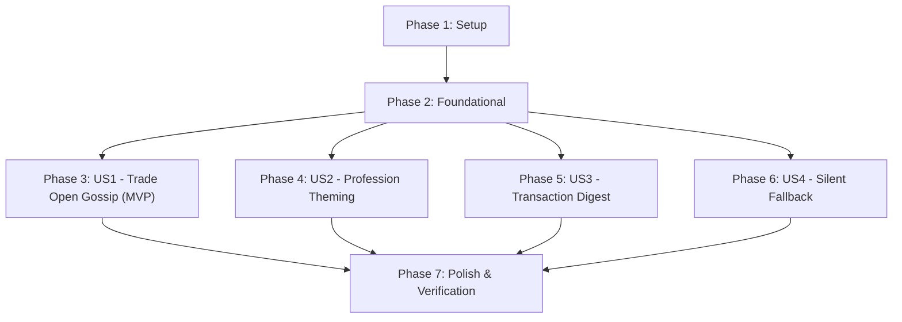

# Tasks: Gemini-Powered Villager Gossip in EconomyCraft

**Input**: Design artifacts from `specs/002-gemini-villager-gossip/`
**Prerequisites**: [plan.md](plan.md), [spec.md](spec.md), [data-model.md](data-model.md), [research.md](research.md), [contracts/](contracts/)

---

## Phase 1: Setup (Shared Infrastructure)

**Purpose**: Project initialization and configuration scaffolding

- [x] T001 Create `gossip` package structure in `/home/yes/projects/EconomyCraft/common/src/main/java/com/reazip/economycraft/gossip`
- [x] T002 Implement `GossipConfig` record and integrate `gemini_gossip` section into `/home/yes/projects/EconomyCraft/common/src/main/java/com/reazip/economycraft/config/EconomyConfig.java`
- [x] T003 [P] Add unit test for `GossipConfig` deserialization and default fallback in `/home/yes/projects/EconomyCraft/common/src/test/java/com/reazip/economycraft/gossip/GossipConfigTest.java`

---

## Phase 2: Foundational (Blocking Prerequisites)

**Purpose**: Core data models, client abstraction, and sanitization pipeline that block all user stories

- [x] T004 Define `GossipCategory` enum and `GossipPool` record in `/home/yes/projects/EconomyCraft/common/src/main/java/com/reazip/economycraft/gossip/GossipCategory.java` and `/home/yes/projects/EconomyCraft/common/src/main/java/com/reazip/economycraft/gossip/GossipPool.java`
- [x] T005 [P] Implement `GeminiClient` with Java 21 `HttpClient`, `x-goog-api-key` header authentication, `BLOCK_ONLY_HIGH` safety settings, `thinkingBudget: 0`, timeouts (10s connect, 25s request), and circuit breaker (3 failures -> 30m pause) in `/home/yes/projects/EconomyCraft/common/src/main/java/com/reazip/economycraft/gossip/GeminiClient.java`
- [x] T006 [P] Add unit tests for `GeminiClient` request/response parsing and circuit breaker in `/home/yes/projects/EconomyCraft/common/src/test/java/com/reazip/economycraft/gossip/GeminiClientTest.java`
- [x] T007 Implement `TransactionAnonymizer` with archetype mapping and anvil-rename/format-code injection stripping in `/home/yes/projects/EconomyCraft/common/src/main/java/com/reazip/economycraft/gossip/TransactionAnonymizer.java`
- [x] T008 [P] Add unit test for `TransactionAnonymizer` verifying archetype translation and injection sanitization in `/home/yes/projects/EconomyCraft/common/src/test/java/com/reazip/economycraft/gossip/TransactionAnonymizerTest.java`

---

## Phase 3: User Story 1 - Contextual Villager Economic Gossip on Trade Open (Priority: P1) 🎯 MVP

**Goal**: Deliver humorous, private in-game economic gossip from villagers to players on trade open, backed by interaction cooldowns and zero chat spam.

**Independent Test**: Trade with any villager with active rumors; verify a private chat rumor appears and subsequent trade opens within 3 minutes stay silent.

### Implementation for User Story 1

- [x] T009 [P] [US1] Implement `CooldownTracker` with composite `(playerUuid, villagerUuid)` key and expiration pruning in `/home/yes/projects/EconomyCraft/common/src/main/java/com/reazip/economycraft/gossip/CooldownTracker.java`
- [x] T010 [P] [US1] Add unit test for `CooldownTracker` verifying per-player cooldown expiry in `/home/yes/projects/EconomyCraft/common/src/test/java/com/reazip/economycraft/gossip/CooldownTrackerTest.java`
- [x] T011 [US1] Implement `VillagerGossipListener` registering Fabric `UseEntityCallback.EVENT` to intercept villager trade opening and send colored chat messages (private to player by default, or public broadcast if `public_chat = true`) in `/home/yes/projects/EconomyCraft/common/src/main/java/com/reazip/economycraft/gossip/VillagerGossipListener.java`
- [x] T012 [US1] Wire `GossipPool` cache initialization and event listener registration into `/home/yes/projects/EconomyCraft/common/src/main/java/com/reazip/economycraft/EconomyCraft.java`

---

## Phase 4: User Story 2 - Profession-Themed Gossip Personalities (Priority: P2)

**Goal**: Tailor rumors to villager professions so farmers talk food/inflation, smiths talk weapons/diamonds, clerics talk taxes/parties, and nitwits share conspiracies.

**Independent Test**: Open trade with a Farmer and Weaponsmith; verify that delivered rumors match each profession's specific category pool.

### Implementation for User Story 2

- [x] T013 [P] [US2] Implement `ProfessionMapper` converting Minecraft `VillagerProfession` to `GossipCategory` in `/home/yes/projects/EconomyCraft/common/src/main/java/com/reazip/economycraft/gossip/ProfessionMapper.java`
- [x] T014 [P] [US2] Add unit test for `ProfessionMapper` covering all vanilla professions in `/home/yes/projects/EconomyCraft/common/src/test/java/com/reazip/economycraft/gossip/ProfessionMapperTest.java`
- [x] T015 [US2] Integrate `ProfessionMapper` into `VillagerGossipListener` to select profession-specific rumors from `GossipPool` in `/home/yes/projects/EconomyCraft/common/src/main/java/com/reazip/economycraft/gossip/VillagerGossipListener.java`

---

## Phase 5: User Story 3 - Automatic Transaction Digestion & Privacy Anonymization (Priority: P3)

**Goal**: Ingest recent transaction logs periodically, anonymize player names into archetypes, generate structured rumors via Gemini, and atomically update the in-memory pool.

**Independent Test**: Feed sample transaction logs into the worker; verify prompt output uses archetypes and resulting rumors are swapped into `GossipPool`.

### Implementation for User Story 3

- [x] T016 [US3] Implement `GossipDigestWorker` background scheduled executor reading transactions via `TransactionLogReader`, gathering inflation metrics, and executing prompts in `/home/yes/projects/EconomyCraft/common/src/main/java/com/reazip/economycraft/gossip/GossipDigestWorker.java`
- [x] T017 [P] [US3] Add unit test for `GossipDigestWorker` transaction filtering and significance scoring in `/home/yes/projects/EconomyCraft/common/src/test/java/com/reazip/economycraft/gossip/GossipDigestWorkerTest.java`
- [x] T018 [US3] Connect `GossipDigestWorker` to update `AtomicReference<GossipPool>` atomically on generation and register startup/shutdown hooks in `/home/yes/projects/EconomyCraft/common/src/main/java/com/reazip/economycraft/EconomyCraft.java`

---

## Phase 6: User Story 4 - Resilient Silent Fallback (Priority: P4)

**Goal**: Ensure the server and trading gameplay degrade completely silently if the API key is unset, network fails, or quota limits are reached.

**Independent Test**: Clear API key or simulate network disconnect; open trades and verify zero errors in console or player chat.

### Implementation for User Story 4

- [x] T019 [US4] Implement silent degradation and error isolation in `GeminiClient` and `VillagerGossipListener` in `/home/yes/projects/EconomyCraft/common/src/main/java/com/reazip/economycraft/gossip/GeminiClient.java`
- [x] T020 [P] [US4] Add unit test asserting missing API key or 429 response leaves `GossipPool` safely empty without throwing exceptions in `/home/yes/projects/EconomyCraft/common/src/test/java/com/reazip/economycraft/gossip/ResilienceTest.java`

---

## Phase 7: Polish & Verification

**Purpose**: Cross-cutting documentation and end-to-end verification

- [x] T021 [P] Add documentation notes for `gemini_gossip` config block to `/home/yes/pterodactyl/operations/config-changes.md`
- [x] T022 Run complete test suite `./gradlew :common:test` in `/home/yes/projects/EconomyCraft`
- [x] T023 Run verification checklist following `specs/002-gemini-villager-gossip/quickstart.md`

---

## Dependencies & Execution Order

### Phase Dependencies

### Parallel Opportunities

- Setup: `T002` (config) and `T003` (config tests) can run in parallel.
- Foundational: `T005` (`GeminiClient`) and `T007` (`TransactionAnonymizer`) can run in parallel.
- User Story 1: `T009` (`CooldownTracker`) and `T010` (test) can run in parallel.
- User Story 2: `T013` (`ProfessionMapper`) and `T014` (test) can run in parallel.
- User Story 4: `T019` (resilience logic) and `T020` (resilience test) can run in parallel.

---

## Implementation Strategy

### MVP Delivery (Phase 1 to Phase 3)

1. Complete Setup (`T001`–`T003`) and Foundational (`T004`–`T008`).
2. Complete User Story 1 (`T009`–`T012`).
3. **Validate MVP**: Test trade opening with a populated mock rumor pool. Villager greets player; cooldown works; zero chat spam.

### Full Delivery (Phase 4 to Phase 7)

1. Add Profession Theming (US2: `T013`–`T015`).
2. Add Transaction Digestion & Gemini Prompting (US3: `T016`–`T018`).
3. Add Silent Fallback & Circuit Breaker testing (US4: `T019`–`T020`).
4. Execute Polish & End-to-End Verification (`T021`–`T023`).
